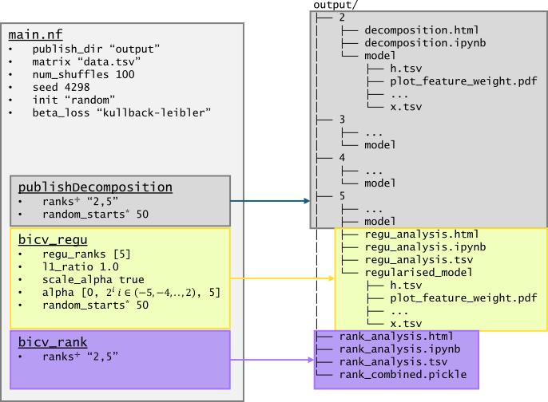

# Nextflow execution

Some inputs may be too large to run a desktop computer, and would be better 
run on an HPC or cloud compute environment. We provide a Nextflow pipeline 
for running in these environments.

Introductions and more advanced training on Nextflow are available from 
[nextflow.io](https://training.nextflow.io/) and 
[nf-co.re](https://nf-co.re/docs/usage/getting_started/introduction).

The nextflow pipeline is part of this repository (apduncan/cvanmf).


## Outline


On the left is the workflow, with a few sub-steps picked out, with 
parameters listed. All the parameters in the `main.nf` box are used in each 
of the sub-steps. Where parameters are shared across two of the sub-steps, 
this is indicated with a superscript symbol. Structure of output is shown on 
the right.

These are the main processes and a summary of their outputs. 
* Rank selection: For all ranks in the range specified by parameter `ranks`, 
  bicrossvalidation rank selection is performed. Plots of the results are 
  produced as a notebook (`rank_analysis.ipynb`), which processes the bicv 
  results (`BicvResult` class objects) which are in `rank_combined.
  pickle`. The notebook is also compiled to static HTML, and a table 
  summarising the results produced (`rank_analysis.html`, `rank_analysis.tsv`)
* Model generation: For each rank in the range specified by `ranks`, a model 
  with no regularisation applied is generated. Results are output as a mix 
  tab-separated, YAML, and PDF plots. This folder `model` can be loaded 
  using the method `Decomposition.load`.
* Regularisation selection: For each rank in the parameter `regu_rank`, 
  bicrossvalidation regularisation selection is run. By default, no ranks 
  are included, and typically you would only perform regularisation 
  selection for ranks that look suitable in rank selection. For each rank, 
  results are output as a notebook, which is compiled to HTML and summarised 
  as a tab-separated table. A model with the heuristically identified best 
  value for alpha is generated, and saved in the format described for model 
  generation. 

## Requirements

We suggest two ways to deal with package requirements: containers, or 
conda/mamba/micromamba. Each of them is explained below. Our recommendation
for reproducibility is to use containers if possible.

### Containers (docker, singularity)
A docker image with all pipeline requirements is [available from Github 
Container Registry](https://github.com/apduncan/cvanmf/pkgs/container/cvanmf).
The most recent version, with some additional packages
needed by the pipeline, is `ghcr.io/apduncan/cvanmf:latest-nf`. Tags for
specific versions are available in the form `ghcr.io/apduncan/cvanmf:0.3.1-nf`.

### Micromamba (or conda, mamba)
Required packages can be installed via `micromamba`/`conda`, and are listed in 
`env.yaml`. However, you probably don't need to make an environment 
manually: the pipelines configuration has a profile which will attempt to 
automatically create a conda environment. This should work unless the 
environment you want to run in has no or limited internet access.

## Example data

Throughout examples here, we use an example input `sample.tsv`. You can use 
your own data, or download some example data 
[here](https://raw.githubusercontent.com/apduncan/cvanmf/main/resources/test_data.tsv) 
or with the command below:

```
curl https://raw.githubusercontent.com/apduncan/cvanmf/main/resources/test_data.tsv > sample.tsv
```

## Basic execution

To run the pipeline on a single machine or node, you can run it as below for 
a sample matrix `sample.tsv`. This runs only for ranks 2 and 3, and with 
only 3 iterations, as a quick running example.

```
nextflow run apduncan/cvanmf -r main -profile conda \
--matrix sample.tsv --ranks 2,3 --publish_dir output/sample --num_shuffles 3
```

Parameter `-profile conda` selects the profile which will attempt to create 
a conda environment with the required packages. 
If you have docker engine installed, you could instead use `-profile docker`
which will run each job in a container with all dependencies.

Everything prefixed by `--` is setting one of the parameters listed in the 
[parameter list](#parameter-list). For how to provide values for 
regularisation selection, please see 
[customising configuration files](#customising-configuration-files) as these 
cannot be easily provided at commandline currently.

If the run fails, you can resume the previous run after fixing the issue by 
adding the `-resume` flag

```
nextflow run apduncan/cvanmf -r main -profile conda -resume \
--matrix sample.tsv --ranks 2,3 --publish_dir output/sample --num_shuffles 3
```

You can read more about caching and resuming in Nextflow 
[here](https://www.nextflow.io/docs/latest/cache-and-resume.html).

## Customising configuration files

Currently some of the [pipeline parameters](#parameter-list) are not easily 
passed at the command line; primarily those which are lists of values, such 
a `regu_rank`. If you want to customise these, you can create a custom 
configuration file.

For this example, let us assume we have run rank selection on some data, and 
have identified ranks 4 and 8 as of interest, and we want to perform 
regularisation selection for these ranks.

To do this, in the directory we are running the pipeline in, we create a new 
file named `custom.config` (you could call it anything), with the content

```
params.regu_rank = [4,8]
params.seed = 729108
```

When we pass this file to nextflow, the contents will override any of the 
values in the default configuration. Then, any command line parameters will 
be applied. Now we run

```
nextflow run apduncan/cvanmf -r main -profile conda -c custom.config \
-resume \
--matrix sample.tsv --ranks 2,3 --publish_dir output/sample --seed 4298 \
--num_shuffles 3
```

Here, the pipeline will and perform regularisation selection for ranks 4 and 8.
However, the seed used will be 4298. Command line parameters override 
anything provided in config files.

## Customising for SLURM environment

Rather than running all processes on a single node, Nextflow can be set up 
to submit individual tasks to a scheduler such a SLURM. These examples will 
use SLURM, but [many other schedulers are supported by Nextflow](https://www.nextflow.io/docs/latest/executor.html).

We can make a custom config file which will contain the setting needed for 
SLURM. Here, we are going to configure a SLURM cluster, on which we use 
`micromamba` to manage environments (see 
[the micromamba section](#micromamba-troubleshooting) for some 
troubleshooting with micromamba). Make the file `slurm.config` with the contents

```
profiles {
    slurm {
        // Say we want to use the slurm executor
        executor {
          name = 'slurm'
        }
        // Use micromamba to create environments
        conda.enabled = true
        conda.useMicromamba = true
        // Everything in the process block will apply to all processes run 
        // by Nextflow
        process {
            conda = "${projectDir}/env.yaml"
            // By default, jobs will be submitted to the queue 'ei-short'
            queue = 'ei-short'
            // We'll request 1.5GB and 4 CPUs by default
            memory = '1.5GB'
            cpus = 4
            // Some processes use more memory, and we've labelled these with 
            // the 'largemem' label. Any settings in here will apply to 
            // any of these more memory intensive tasks.
            withLabel: largemem {
                // Typically our processes requiring a lot of memory are
                // splitting and merging data, and not very computationally
                // demanding
                queue = 'ei-short'
                memory = '8GB'
                cpus = 2
            }
            withName: "reguBiCv|rankBiCv" {
              // The pipeline generates a lot of these jobs with identical
              // requirements. It is better for the SLURM scheduler if these
              // are submitted as a job array. Nextflow can handle that for
              // us
              array = 1000
            }
        }
    }
}
```

Replace the queue names with the queues specific to your HPC setup. To use 
`conda`, remove `conda.useMicromamba`. To use `mamba`, replace 
`conda.useMicromamba` with `conda.useMamba`.

The pipeline can now be run using

```
nextflow run apduncan/cvanmf -r main -profile slurm -c custom.config \
-c slurm.config -resume \
--matrix sample.tsv --ranks 2,3 --publish_dir output/sample --seed 4298 \
--num_shuffles 3
```

Note that we can provide multiple config files to Nextflow, and that the 
slurm profile was selected using `-profile slurm`

### Using containers with SLURM
Rather than conda or equivalents, you can use containers to handle 
requirements. We give some instructions for singularity (as this seems most
common on HPC platforms) and docker, though other container engines are 
supported by Nextflow. Below is a summary of configuring the pipeline to use 
containers, for more detail please seethe 
[Nextflow documentation](https://www.nextflow.io/docs/latest/container.html).

Please note currently our containers are only built for amd64 architecture.
If you need to use a different architecture, you will need to build the image
from the Dockerfile in `docker/nf/`.

#### singularity
To use singularity, you can either provide details of the singularity image
at the command line, or in the configuration file.

At the command line
```
nextflow run apduncan/cvanmf \
-with-singularity docker://ghcr.io/apduncan/cvanmf:latest-nf \
-r main -profile slurm -c custom.config \
-resume \
--matrix sample.tsv --ranks 2,3 --publish_dir output/sample --seed 4298 \
--num_shuffles 3
```
Nextflow can retrieve a docker image from a registry when given the 
`docker://` prefix and convert this to a singularity image. The produced
singularity image will be stored in a cache, which can be configured using
the singularity.libraryDir configuration setting or the NXF_SINGULARITY_LIBRARYDIR 
environmental variable
([see docs](https://www.nextflow.io/docs/latest/container.html#singularity-docker-hub)),
so the image will not be fetched every time.
You could instead give the path to a singularity image, such as in the case
where your computing environment has no internet access to pull the container.

To avoid having to specify the container each time, you can instead add this to your 
configuration profile:
```
profiles {
    slurm {
        (...)
        singularity.enabled = true
        process {
            // Remove any conda related settings as well
            container = 'docker://ghcr.io/apduncan/cvanmf:latest-nf'
            // You could specify a path to a .sif image as well, if 
            // you do not want Nextflow to try to pull and convert
            // the image.
            (...)
            }
        }
    }
}
```

#### docker
To use docker, you can either provide details of the image at the command 
line, or in the configuration file.

At the command line
```
nextflow run apduncan/cvanmf \
-with-docker ghcr.io/apduncan/cvanmf:latest-nf \
-r main -profile slurm -c custom.config \
-resume \
--matrix sample.tsv --ranks 2,3 --publish_dir output/sample --seed 4298 \
--num_shuffles 3
```

To avoid having to specify each time, you can instead add this to your configuration
profile:
```
profiles {
    slurm {
        (...)
        docker.enabled = true
        process {
            // Remove any conda related settings as well
            container = 'ghcr.io/apduncan/cvanmf:latest-nf'
            // You could specify a path to a .sif image as well, if 
            // you do not want Nextflow to try to pull and convert
            // the image.
            (...)
            }
        }
    }
}
```

### Limiting (or increasing) job submission

The pipeline submits lots of small jobs. If we shuffle the input 
$n=100$ times, and we are searching ranks $k=(2, 3, .., 20)$, each 
combination of $n$ and $k$ is submitted as a separate job. So that is $n|k|$ 
jobs, a total of 1900 in this example. 

By default, Nextflow allows 100 jobs per pipeline to be submitted (pending 
or running). Some cluster setups may reject, or some administrators may 
prefer that you not submit, large amounts of simultaneous jobs. 

On the other hand, you may want to increase the number of simultaneous jobs.

You can change the limit on the number of pending and active jobs 
submitted by Nextflow. Add a queueSize to the executor directive:

```
profiles {
    slurm {
        executor {
          name = 'slurm'
          // Define the number of simultaneous jobs
          queueSize = 25
        }
... 
```

### Memory estimation

It's good practice to avoid requesting too much memory for each job. When 
first running a new dataset, you can get a good report of resource usage by 
running with Nextflow's `-with-report` option 
([documented here](https://www.nextflow.io/docs/latest/tracing.html#execution-report)).

A sensible step could be to run for a single rank and a small number of 
shuffles, and look at the range of memory usage for the processes in report 
produced and pick a sensible value. The amount of memory used for each 
iteration is pretty stable.

```
nextflow run apduncan/cvanmf -r main -profile slurm -c custom.config \
-c slurm.config -resume -with-report report.html \
--matrix sample.tsv --ranks 2,3 --num_shuffles 10 \
--publish_dir output/sample_test --seed 4298
```

### Array jobs
Two processes, `rankBiCv` and `reguBiCv` generate a lot of jobs with
identical requirements. Many schedulers handle these best as array jobs.
The default configuration submits these as array jobs with 500 elements
each. You can alter this using the `process.array` directive in 
configuration. 

For a `slurm` scheduler, you can find the maximum permitted number of jobs
in an array using `scontrol show config | grep "MaxArraySize"`.

## Environments with limited internet access

Some environments have limited access to the internet on compute nodes, and 
such will not be able to fetch the pipeline or conda packages. It is still 
possible to run the pipeline in these environments, with some additional 
setup.

### Singularity
You will first need to create a singularity image from the docker images.
This will need to be done on a system with internet access to pull the
image.

```
singularity pull image.sif docker://ghcr.io/apduncan/cvanmf:0.3.1-nf
```

You can now provide the path to `image.sif` via the command line 
`-with-singularity` or in the `process.container` directive in your
configuration. The file will need to be in a location accessible by
all compute nodes.

We also will need to pull the pipeline so it is available in the Nextflow cache.

```
nextflow pull apduncan/cvanmf
```

### Mamba (conda, micromamba)
First step is to make a conda environment with the required packages. This 
should be made in a directory accessible from all compute nodes.

```
curl https://raw.githubusercontent.com/apduncan/cvanmf/main/env.yaml > env.yaml
mamba env create -n cvapipe -f env.yaml
```

Find the path of the environment

```
> mamba env list | grep cvapipe
cvapipe                    /some/path/mambaforge/envs/cvapipe
```

In the config file with your slurm (other other scheduler) profile, provide the 
path to the conda environment

```
profiles {
    slurm {
        ...
        process {
            conda = '/some/path/mambaforge/envs/cvapipe'
...
```

We also will need to pull the pipeline so it is available in the Nextflow cache.

```
nextflow pull apduncan/cvanmf
```

Now you can submit a job containing a command in the form shown below to run 
the pipeline without needing any internet access.

```
nextflow run apduncan/cvanmf -r main -c slurm.config -profile slurm \
-resume \
--matrix sample.tsv --ranks 2,10 --publish_dir output/sample --seed 4298
```

## micromamba troubleshooting

When using `micromamba` to manage environments, I have occasionally run into 
issues Nextflow being unable to activate the environment, getting errors 
like

```
[...]
Command wrapper:
  /var/spool/slurmd/job1304257/slurm_script: line 325: conda: command not found
  /var/spool/slurmd/job1304257/slurm_script: line 325: /bin/activate: No such file or directory
[...]
```

The solution I [have found](https://github.com/nextflow-io/nextflow/issues/4161)
is to install `conda` in the the environment you're launching the pipeline from.
So if I launch nextflow from the environment `nfenv`

```commandline
micromamba install -n nfenv conda
```

Nextflow will still use micromamba for creating environments, but needs conda in
order to activate the environment, so installing it should make it available 
for that purpose.

## Parameter list

### Shared by all steps
* `matrix`: The matrix to be decomposed. Must be in tab-separated format, with 
  the first column being feature names, the first row being sample names. 
* `num_shuffles`: Number of shuffled matrices to generate for use in 
  bicrossvalidation. Defaults to 100.
* `max_iter`: Maximum number of update iterations during NMF decompositions. 
  Will be terminated earlier if reaching convergence. Defaults to 3000.
* `seed`: Random seed for reproducible results. Defaults to 4298. 
* `init`: Method to seed the $H$ and $W$ matrices during decomposition. Can 
  be either "random" or "nndsvdar". See the 
  [sklearn NMF documentation](https://scikit-learn.org/stable/modules/generated/sklearn.decomposition.NMF.html)
  for more on these methods.
* `beta_loss`: Beta-loss function. Can be one of "kullback-leibler", 
  "frobenius", "itakura-saito". See sklearn documentation for more.
* `publish_dir`: Directory to publish results to.
* `random_starts`: When performing a decomposition of the full matrix, do it 
  this many times and only keep the decomposition which minimises 
  reconstruction error.


### Rank selection
* `ranks`: The lowest and highest rank to be searched, inclusive, as a comma 
  separated string. Defaults to "2,20".
* `stability`: Calculate and report stability based rank selection criteria.
  Default is `true`. Output will be an HTML report `stability_selection.html`
  in the publish directory. This step can require a lot of memory for large
  numbers of samples.

### Regularisation selection
* `alpha`: Regularisation parameter values to search. Defaults to [0, 0.
  03125, 0.0625, 0.125, 0.25, 0.5, 1, 2, 5]
* `scale_alpha`: Scale values of alpha based on the number of 
  samples in the input. The way sklearn applies regularisation changed from 
  previous versions, alpha is now multiplied by number of samples. To get 
  the same behaviour as the Enterosignatures paper, but with more recent 
  versions of sklearn, we divide the alpha by the number of samples. This 
  gives approximately the same behaviour for the range of alphas used for 
  default selection in ES paper.
* `l1_ratio`: The ratio of sparsifying (L1) to densifying (L2) regularisation to
  be applied. Defaults to L1. This is used in rank selection, but with an
  alpha value of 0.0, meaning no regularisation is applied during rank 
  selection. Defaults to 1.0, so sparsifying.
* `regu_rank`: Ranks to perform regularisation selection for. Defaults to [].